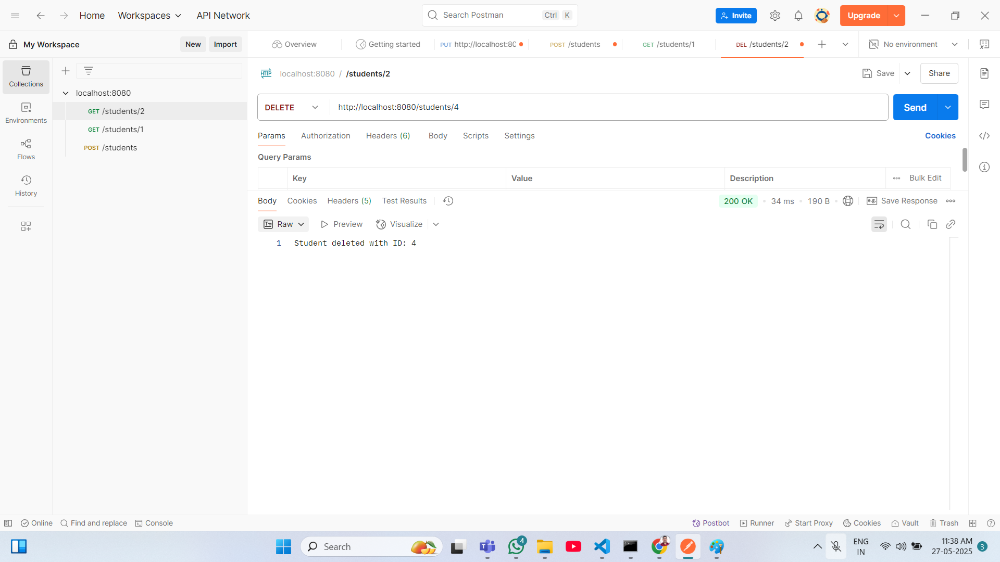

Student Management API using Spring Boot  
Create a REST API for managing student records using Spring Boot and test it using Postman.

🔧 Tasks:
Model:

Student class->

id (Long, auto-generated)

name (String)

email (String)

course (String)

Database Integration

Use either MySQL or H2 for storing student records.

Repository:

StudentRepository

Service:

StudentService 

REST Controller:

Create REST endpoints:-

POST /students – Add a student

GET /students – Get all students

GET /students/{id} – Get student by ID

PUT /students/{id} – Update student by ID

DELETE /students/{id} – Delete student by ID

Testing with Postman

Test all endpoints using Postman and take screenshots of:

Successful POST request

GET all students

PUT update

DELETE request

Screenshots:

Add Student:

Show All Students Data:

Show particular any one of the id data:

Update Student Data:

Delete Student Data:

